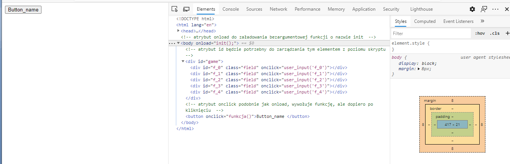
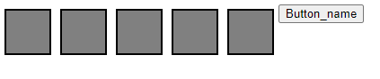
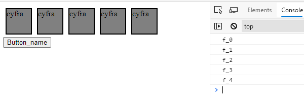

# ECMAScript

Poniżej przedstawiony jest bazowy dokument do ECMAScript. Style oraz skrypty można
dołączyć z oddzielnego pliku, jednak w niewielkich programach stosowanie wszystkiego w
jednym pliku jest również korzystne. Wersja z której będziemy korzystać to ES6. ECMAScript
jest interpretowany w większości przeglądarek i można go uruchomić lokalnie w
przeglądarce bez używania serwera czy localhosta.

Plik: example1.html

``` html
<html <!DOCTYPE html>
<html lang="en">
<head>
  <meta charset="UTF-8">
  <title>Document</title>
  <style>
    /*Miejsce na style CSS*/
  </style>
  <script>
    // miejsce na funkcje skryptowe
  </script>
</head>
<!--atrybut onload do załadowania bezargumentowej funkcji o nazwie init -->
<body onload="init();">
<!--atrybut id będzie potrzebny do zarządzania tym elementem z poziomu skryptu -->
<div id="element">
</div>
<!--atrybut onclick podobnie jak onload, wywołuje funkcję, ale dopiero po kliknięciu -->
<button onclick="funkcja()" >Button_name </button>
</body>
</html>
```

W przypadku uruchomienia tego pliku na ekranie pojawi się jedynie przycisk. Można
również zbadać jak wygląda kod w przeglądarce (w przypadku IE developer tool otwiera się
przy pomocy F12) oraz sprawdzić w konsoli czy poprawnie się załadował. Konsola na pewno
wyrzuci błąd po wciśnięciu przycisku, ponieważ funkcja ta nie została zdefiniowana. Do
wykonania zadań z dzisiejszych zajęć będziemy potrzebować wygenerować kilka elementów,
aby nie robić tego ręcznie można wykorzystać konkatenacje napisów w id konkretnych
elementów blokowych.

``` javascript
function init(){
  for(let j=0;j<5;j++) {
    let element = document.createElement("div")
    element.setAttribute("id","f_"+j) // generujemy id unikalne dla każdego elementu
    element.setAttribute("class","field") // przypisujemy klasę
    element.setAttribute("onclick","user_input('f_"+j+"')") // omijamy konieczność referencji na funkcję
    document.getElementById("game").appendChild(element) //zagnieżdżamy utworzone elementy w div o id game
  }
}
```

Prosta pętla generuje elementy i w tym miejscu warto zapoznać się z elementami składni
ES6:

- Pętle: https://www.tutorialspoint.com/es6/es6_loops.htm
- Różnice między let i var: https://www.tutorialspoint.com/difference-between-var-and-let-in-javascript

Dzięki temu skryptowi powinniśmy dostać gotową strukturę div wyglądającą tak:

``` html
<div id="game">
  <div id="f_0" class="field" onclick="user_input('f_0')"></div>
  <div id="f_1" class="field" onclick="user_input('f_1')"></div>
  <div id="f_2" class="field" onclick="user_input('f_2')"></div>
  <div id="f_3" class="field" onclick="user_input('f_3')"></div>
  <div id="f_4" class="field" onclick="user_input('f_4')"></div>
</div>
```
Czyli mamy:

- id potrzebne do odnoszenia się do konkretnego diva
- klasę po nazwie której obsługiwany jest konkretny styl
- onclick potrzebny do wywołania funkcji user_input o konktrynym id po kliknięciu w dany przycisk

Możemy teraz uruchomić skrypt jednak niewiele się zmieni, na pewno strukturę html
możemy zobaczyć w przeglądarce za pomocą developer toola. Aktualnie w przeglądarce
pojawi się nasza oczekiwana struktura.



Kolejnym krokiem może być dodanie wyglądu, żeby zobaczyć wygenerowane przyciski. Klasa
field będzie naszym odnośnikiem dla stylu. Aby zbliżyć się wizualnie do przycisku klawisza w
kalkulatorze możemy ustalić kolor szary, zrobić niewielką czarną ramkę i odstępy 5-
pikselowe między przyciskami. Aktualnie kod prezentuje się tak:

``` html
<!DOCTYPE html>
<html lang="en">
<head>
  <meta charset="UTF-8">
  <title>Document</title>
  <style>
    .field {
      background-color: gray;
      border: solid 2px black;
      width: 3em;
      margin: 5px;
      height: 3em;
      float: left;
    }
  </style>
  <script>
    function init(){
      for(let j=0;j<5;j++) {
        let element = document.createElement("div")
        element.setAttribute("id","f_"+j)
        element.setAttribute("class","field")
        element.setAttribute("onclick","user_input('f_"+j+"')")
        document.getElementById("game").appendChild(element)
      }
    }
  </script>
</head>
<body onload="init();">
<div id="game">
</div>
<button onclick="funkcja()" >Button_name </button>
</body>
</html>
```

I wygląda tak:



Kolejnym krokiem potrzebnym do stworzenia kalkulatora są opisy przycisków i możemy to
zrobić na przykład wklejając tekst za pomocą innerHTML
(https://www.tutorialspoint.com/html-dom-innerhtml-property). Można również dodać
podświetlenie po najechaniu na element dodając w stylach:

``` css
.field:hover {
  background-color: white;
}
```

Ostatnim krokiem potrzebnym do wykonania zadań będzie obsługa tak wygenerowanego
przycisku i działanie możemy sprawdzić dopisując w części skryptowej:

``` javascript
function user_input(id) {
  console.log(id)
}
```

Działanie można przetestować:



Elementy składni ES6: https://www.tutorialspoint.com/es6/es6_browsers.htm

Mając te informację powinno udać się wykonać dwa zadania zamieszczone w drugim
dokumencie. Bonus z zadania drugiego jest jako zadanie dodatkowe i zrobienie może pomóc
pod koniec semestru jeśli będzie niejasna sytuacja z oceną. Do zrobienia algorytmu można
skorzystać z gotowego rozwiązania https://eduinf.waw.pl/inf/utils/001_2008/0415.php
